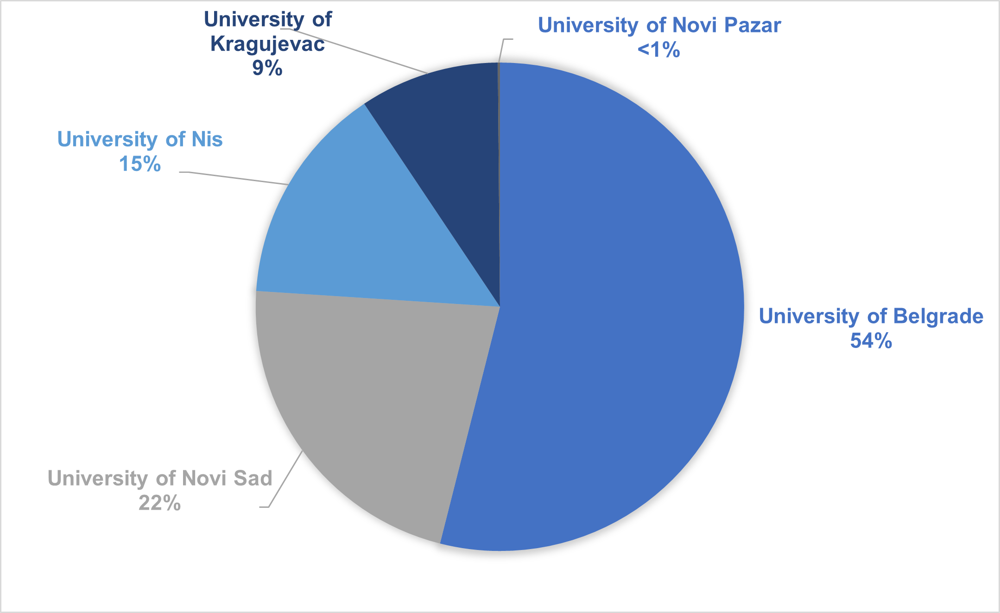

# Scientific Collaborations

## 1. Introduction

This depository is used to build the code and download data on publications, which serves as an input for the analysis and visualization of the collaboration of the Serbian scientific community. This account will be handed over to the UNDP team upon the completion of the project. The goal of the analysis is to investigate the effects of migration on the scientific productivity and collaboration. 

## 2. Microsoft Academic and Data

In our proposal, we planned to download the data for this project through Scopus, but we eventually decided to use Microsof Academic for the following reasons: 
-  Research by [Harzing (2016)](https://www.readcube.com/articles/10.1007%2Fs11192-016-2026-y?author_access_token=VGOe3zUBun4lr3rK7X7Elve4RwlQNchNByi7wbcMAY7hqJRkzHmW-la5Hb7lAW5UO5wuC7aGQklUbjlsjbym7l_d48FItMITdfFmy1EjmH4HGSWbqgsVcyREQzkx3FOZibMQo3KOYmPMaPile46eKQ==) found that Microsoft Academic significantly outperformed the Web of Science and Scopus in terms of both publication and citation coverage,
-  Microsoft Academic can be used free of charge, while the other services cannot. 
-  Microsoft Academic does not limit the data that can be downloaded through its API, while the other services do.

### 2.1. Micorsoft Academic API

The API enables users to retrieve information from Microsoft Academic Graph (MAG). The provided data includes six types of entities. These entities are paper, field of study, author, institution (affiliation of author), venue (journal or conference series), and event (conference instances). 

| Name                | Count          |
| :-----------------: | :------------: |
| Publications        | > 244 million  |
| Authors             | > 200 million  |
| Institutions        | > 25 thousand  |
| Journals            | > 50 thousand  |
| Topics              | > 700 thousand |
| Citations           | > 2.3 billion  |

MAG data can be accessed in three different ways: by using the MA search engine, by downloading historical snapshots of MAG, or by employing the AK API. The AK API offers the Interpret, the Evaluate and the CalcHistogram method for retrieving data from MAG. The Evaluate method retrieves a set of attributes based on a query expression. Query expressions can be built with entity attributes. An Evaluate request yields one or several matching results, or none, in case there is no match. Each result contains a natural log probability value to indicate the quality of the match. Thus, the Evaluate method is a means for collecting raw metadata from MA. 

In the AK API, there are 18 entity attributes that can be used to build query expressions as well as to specify the response of a query. Eight attributes are linked to the entity paper, four to the entity author, and two to each of the entities field of study, journal, and venue: paper—title, ID, year of publication, date of publication, citation count, estimated citation count, reference ID, words from title or abstract; author—name, ID, affiliation, affiliation ID; field of study/journal/venue—name, ID. In addition, there are 12 extended metadata attributes, which—in contrast to the 18 entity attributes—can only be used for specifying the query response. The 12
extended metadata attributes are available for the entities paper (ten attributes) and venue (two attributes): paper—volume, issue, first page, last page, DOI, display name of the paper, description (e.g. abstract), list of web sources of the paper, source format (e.g. HTML, PDF, PPT), source URL; venue—display name, short name.

As required by the liscense, we acknowledge [Microsoft Academic]( https://aka.ms/msracad). Find out more about the data schema of the Microsoft Academic Graph at: https://docs.microsoft.com/en-us/academic-services/graph/reference-data-schema

### 2.2. Exploring the data

The downloaded data can be found in the repo scientific_collabs/data. Here, we will explore the data. 

